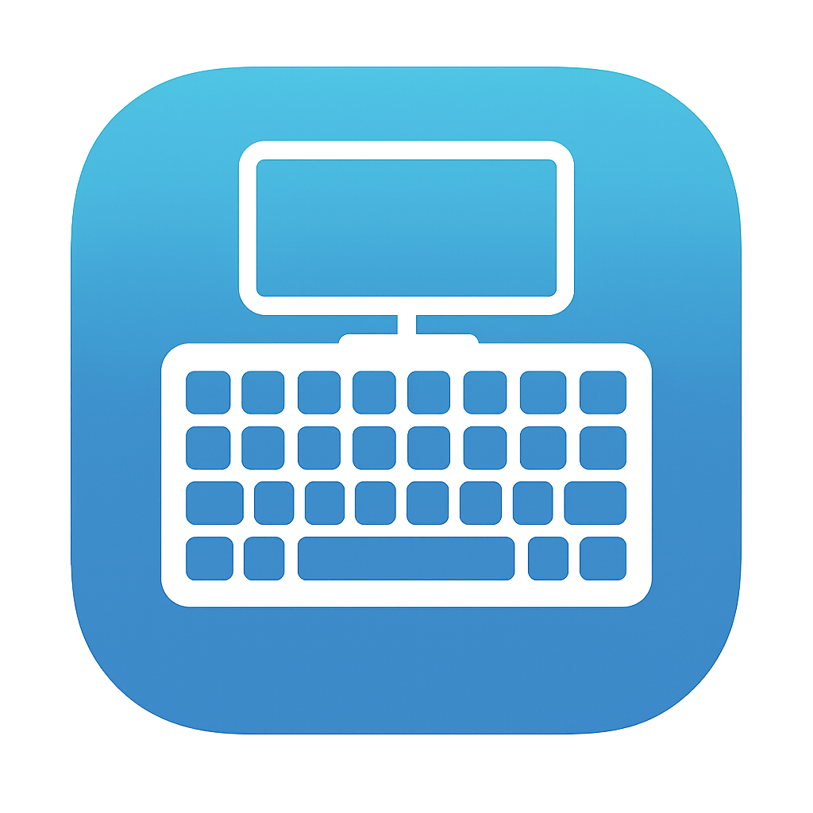

<p align="center">
    
</p>

# Tabtip.Avalonia (Tablet Text Input Panel)
[](https://www.nuget.org/packages/TabTip.Avalonia/)

> Avalonia-based and cross-platform re-imagining of [WPFTabTip](https://github.com/maximcus/WPFTabTip)

> [!NOTE]  
> Currently, the Software Keyboard is only supported on Windows and the default `TabTipIntegration` triggers based
> **only** on the PointerType that is used when clicking a TextBox. This is all configurable. In the future, I'm looking
> to add some functionality to allow detecting whether a hardware keyboard is connected so that we can forgo triggering
> the software keyboard if the hardware keyboard is connected.

# Usage

The easiest way to use this library is to install the [NuGet package](https://www.nuget.org/packages/TabTip.Avalonia/)
and then add the following to `App.xaml.cs`:

```csharp
// At the top of your  file
using TabTip.Avalonia;

public override void OnFrameworkInitializationCompleted()
{
    // ...

    // Integrate the tabtip manager into the entire app.
    TabTipManager.Integrate();

    // ...
}
```

## Software Keyboard Trigger
By default, the software keyboard is only opened if the PointerType used when clicking is either `PointerType.Touch` or
`PointerType.Pen`.
If you would like to use any other setting, provide an array of `PointerType`s that you want to trigger the software
keyboard as below:

```csharp
// Trigger on all pointer types.
TabTipManager.OverrideIntegrationTrigger([PointerType.Touch, PointerType.Mouse, PointerType.Pen]);
```

## TabTip Factory
The `ITabTipFactory` interface allows you to provide your own implementation of the `ITabTip` interface, giving you the flexibility to create it based
on which OS the host is running on. The current default is `DefaultTabTipFactory` which creates a `TabTip` instance for Windows or, if not running on Windows,
simply creates a `NullTabTip` instance, which has an empty `Toggle` method so that we don't do anything on other OSs.

### Overriding TabTip Factory
To override the default factory,
provide an implementation of `ITabTipFactory` to `TabTipManager.OverrideTabTipFactory` as follows:
```csharp
TabTipManager.OverrideTabTipFactory(myCustomFactory);
```

This will change the factory used and set the `TabTip` used by the manager to the one returned by `myCustomFactory`.

## TabTip
The TabTip is the platform-specific implementation of the `ITabTip` interface. It is responsible for opening and closing
the software keyboard. We currently have only two built-in implementations:
- NullTabTip: Does nothing.
- WindowsTabTip: Contains logic to open the Software Keyboard on Windows.

### Overriding TabTip
The recommended way to override the TabTip used it to override the `ITabTipFactory` [as described above](#overriding-tabtip-factory).

## TabTip Integration
The `ITabTipIntegration` interface defines the methods used to integrate the `TabTip` into the application. The implementing
class is responsible for when to trigger the `TabTip` as well as setting up the appropriate event handlers to know
when a `TextBox` has been clicked.

### Overriding TabTip Integration
Before fully replacing the default integration, it is recommended to override the `TabTipIntegration` class.
The `Integrate` method is purposefully virtual so that it can be overridden. Simply create a new class that inherits from
`TabTipIntegration` and override the `Integrate` method. If you specifically call `base.Integrate()` in your override,
it will call the default implementation of `Integrate` which will set up the default event handlers while allowing you to
add any new ones you want. This is useful if all you want to do is integrate controls other than `TextBox`.

Regardless of whether you create a brand new class that implements `ITabTipIntegration` or extends `TabTipIntegration`,
you need to set it as the one that is used by calling:
```csharp
TabTipManager.OverrideIntegration(myCustomIntegration);
```

# OS Support

| OS         | Supported | Notes                                                                                                                |
|------------|-----------|----------------------------------------------------------------------------------------------------------------------|
| Windows    | ✅         |                                                                                                                      |
| Mac        | ❌⚠️       | Macs don't currently have touchscreens so... I don't see the benefit of adding support. Let me know if you disagree! |
| Linux      | ❌         | I might look into adding support in future versions but I suspect this will require distro-specific handling.        |
| Android    | ❌⚠️       | I have not added specific support for this library as I THINK Avalonia already supports Android properly.            |
| iOs/iPadOS | ❌⚠️       | I have not added specific support for this library as I THINK Avalonia already supports Android properly.            |

### Why the name `TabTip`?

"TabTip" refers to the **Touch Keyboard and Handwriting Panel**, also known as the **Tablet Text Input Panel**, which is
a virtual keyboard in Windows.
Since this project was heavily inspired by the WPF version, the name is also inspired by the WPF version.

### Roadmap (non-binding 🙃)

1. Make it possible to detect if a Hardware Keyboard is connected.
2. Add a method like `Integrate` which allows us to specify a specific control so that it integrates it and all its
   children **only**.
    - ex: `Integrate(MyCustomControlReference)` would trigger for that control and all its children, but not any other
      controls in the app.
3. Add an AttachedProperty or something that will integrate the control it's attached to. Not sure if this is an
   attached property or not but basically, the same
   way [ToolTip](https://docs.avaloniaui.net/docs/reference/controls/tooltip) works.
4. Add code to add the relevant interfaces/classes to DI using `Microsoft.Extensions.DependencyInjection`
5. Add support for Linux?