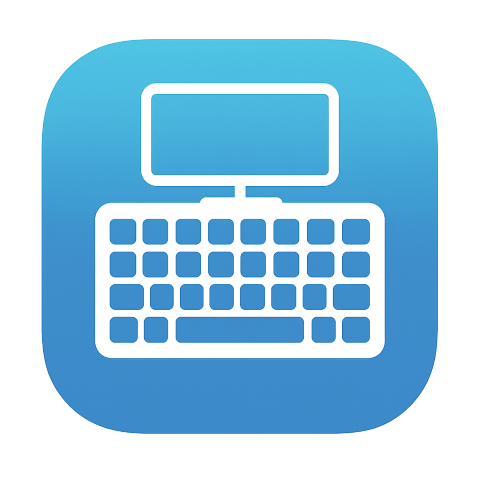

<p align="center">
    
</p>

# Tabtip.Avalonia (Tablet Text Input Panel)

> Avalonia-based and cross-platform re-imagining of [WPFTabTip](https://github.com/maximcus/WPFTabTip)

> [!NOTE]  
> Currently, the Software Keyboard is only supported on Windows and the default `TabTipIntegration` triggers based
> **only** on the PointerType that is used when clicking a TextBox. This is all configurable. In the future, I'm looking
> to add some functionality to allow detecting whether a hardware keyboard is connected so that we can forgo triggering
> the software keyboard if the hardware keyboard is connected.

# Usage

The easiest way to use this library is to install the [NuGet package](https://www.nuget.org/packages/TabTip.Avalonia/)
and then add the following to `App.xaml.cs`:

```csharp
// At the top of your  file
using TabTip.Avalonia;

public override void OnFrameworkInitializationCompleted()
{
    // ...

    // Integrate the tabtip manager into the entire app.
    TabTipManager.Integrate();

    // ...
}
```

By default, the software keyboard is only opened if the PointerType used when clicking is either `PointerType.Touch` or
`PointerType.Pen`.
If you would like to use any other setting, provide an array of `PointerType`s that you want to trigger the software
keyboard as below:

```csharp
// Trigger on all pointer types.
TabTipManager.OverrideIntegrationTrigger([PointerType.Touch, PointerType.Mouse, PointerType.Pen]);
```

# OS Support

| OS         | Supported | Notes                                                                                                                |
|------------|-----------|----------------------------------------------------------------------------------------------------------------------|
| Windows    | ✅         |                                                                                                                      |
| Mac        | ❌⚠️       | Macs don't currently have touchscreens so... I don't see the benefit of adding support. Let me know if you disagree! |
| Linux      | ❌         | I might look into adding support in future versions but I suspect this will require distro-specific handling.        |
| Android    | ❌⚠️       | I have not added specific support for this library as I THINK Avalonia already supports Android properly.            |
| iOs/iPadOS | ❌⚠️       | I have not added specific support for this library as I THINK Avalonia already supports Android properly.            |

### Why the name `TabTip`?

"TabTip" refers to the **Touch Keyboard and Handwriting Panel**, also known as the **Tablet Text Input Panel**, which is
a virtual keyboard in Windows.
Since this project was heavily inspired by the WPF version, the name is also inspired by the WPF version.

### Roadmap (non-binding 🙃)

1. Make it possible to detect if a Hardware Keyboard is connected.
2. Add a method like `Integrate` which allows us to specify a specific control so that it integrates it and all its
   children **only**.
    - ex: `Integrate(MyCustomControlReference)` would trigger for that control and all its children, but not any other
      controls in the app.
3. Add an AttachedProperty or something that will integrate the control it's attached to. Not sure if this is an
   attached property or not but basically, the same
   way [ToolTip](https://docs.avaloniaui.net/docs/reference/controls/tooltip) works.
4. Add code to add the relevant interfaces/classes to DI using `Microsoft.Extensions.DependencyInjection`
5. Add support for Linux?